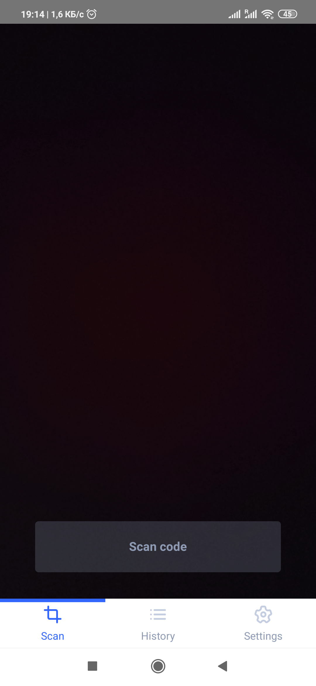
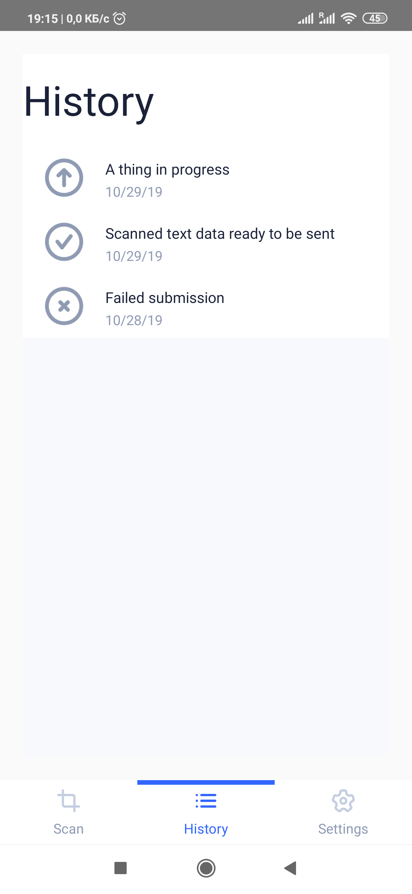
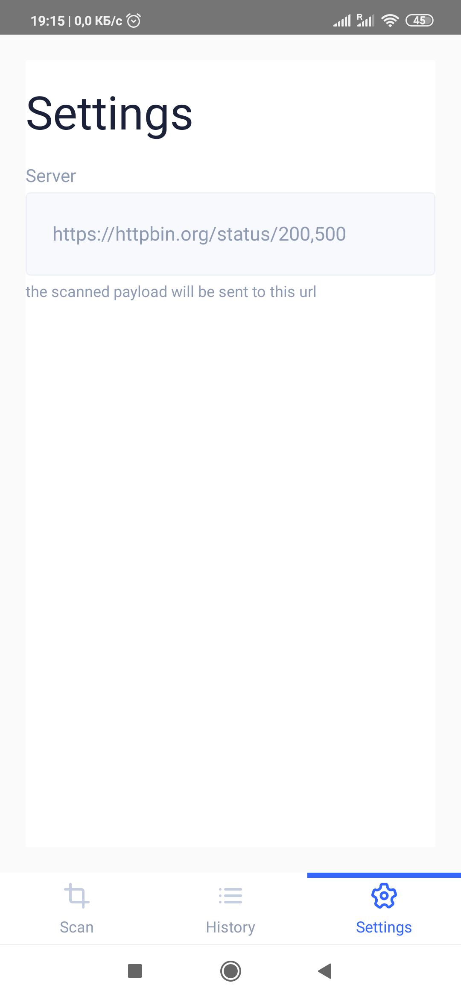

# RealWorldApp

this is [realworld webapp](https://github.com/gothinkster/realworld) for mobile frameworks

### See how *the exact same* app is built using any of cross-platform mobile frameworks.

The overall idea is to make use of most hot-used mobile features and be a show-case

- [x] Camera
- [x] Adding ecosystem library (QR code parser)
- [x] Making HTTP requests
- [ ] Geolocation (TODO)
- [ ] Fingerprint (TODO)

## Frameworks

### [Expo](https://github.com/ByJIKaHkaz/realapp_expo)
### [React Native](https://github.com/lunatic-cat/realapp)

