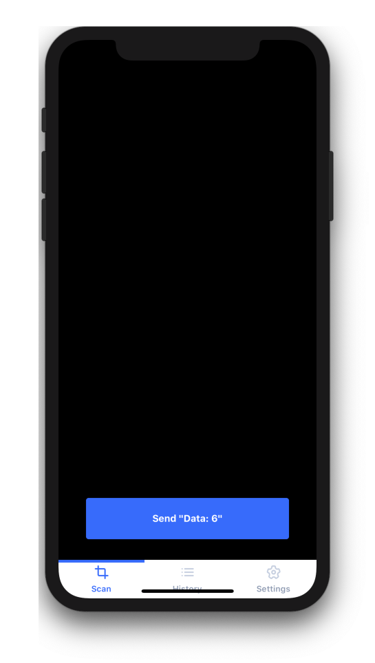
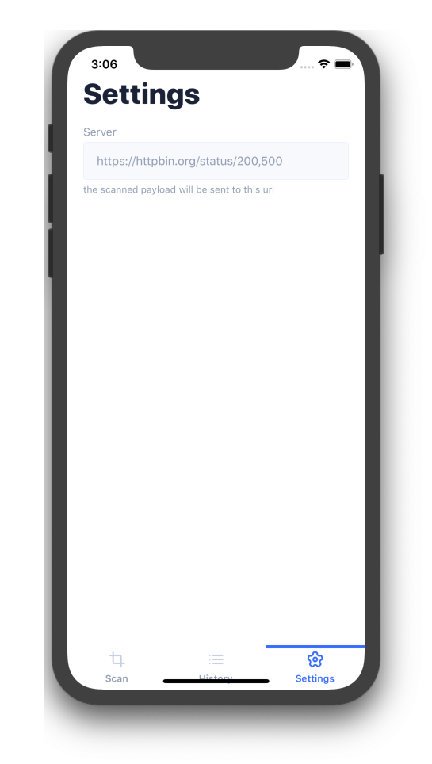

# RealWorldApp

this is [realworld webapp](https://github.com/gothinkster/realworld) for mobile frameworks

### See how *the exact same* qrcode scanner application clone is built using any of mobile fraameworks.

## Frameworks

### [React Native](https://github.com/lunatic-cat/realapp)

